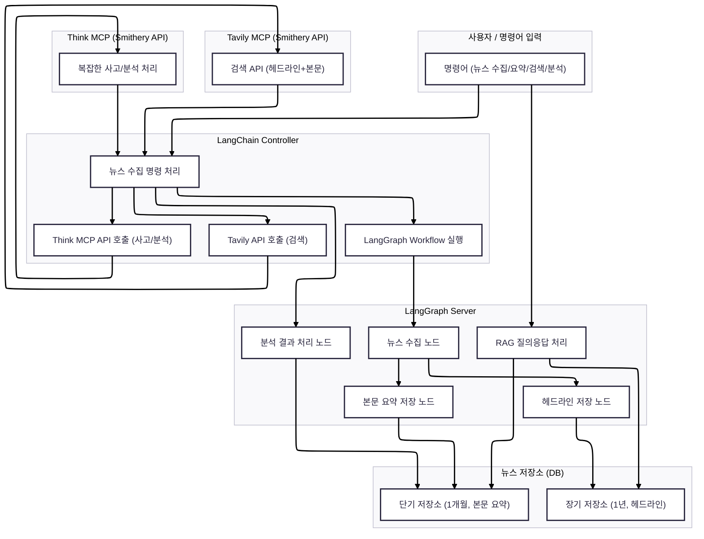

이 프로젝트의 시작은 다음 명령어로 시작한다.
```bash
git clone https://github.com/Daewon-0/portfolio/tree/master
uv python main.py
```

이 프로젝트는 uv를 사용한다.
uv는 Python 패키지 매니저로써 pip의 대체재 역할을 한다.
uv는 가상환경이나 패키지 설치를 한번에 해결해준다.
---
# 프로젝트 아키텍처

